# Drzewa w Polsce
## Opis
**Drzewa** są roślinami wieloletnimi, mającymi zdrewniały jeden pęd główny (pień) lub kilka pędów głównych i gałęzi, tworzących koronę. To największe lądowe rośliny, rekordziści osiągają ponad 100 metrów wysokości. Drzewo nie jest jednostką systematyczną, to tylko grupa podobnych organizmów roślinnych. Drzewa istnieją na ziemi od 370 milionów lat. Nauka o drzewach to **dendrologia**.
## Podział drzew
Tradycyjnie stosuje się podział na:
- **Drzewa iglaste (szpilkowe)** to drzewa należące do roślin nagonasiennych. Mają liście w postaci igieł lub łusek. Z niewielkimi wyjątkami (modrzew, metasekwoja, cypryśnik błotny, modrzewnik, Glyptostrobus pensilis) to rośliny wiecznie zielone, czyli takie, które nie zrzucają igieł na zimę. Drzewa iglaste dominują w chłodnym klimacie. Czasem do grupy drzew iglastych zalicza się także miłorząb dwuklapowy i przęśl.
- **Drzewa liściaste** to drzewa z grupy roślin okrytonasiennych. Mają stosunkowo szerokie blaszki liści. Występują głównie w ciepłym i umiarkowanym klimacie. W klimacie umiarkowanym najczęściej zrzucają liście na zimę.
## Gatunki drzew w Polsce
### [Brzoza brodawkowata](drzewa/brzoza_brodawkowata.md)
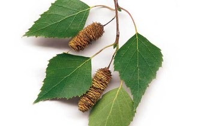

Betula pendula – łac. betula „brzoza”;  łac. pendulus „zwisający, obwisły” (dotyczy charakterystycznych, zwisających gałęzi) Rodzina: Brzozowate (Betulaceae)
### [Buk pospolity](drzewa/buk_pospolity.md)
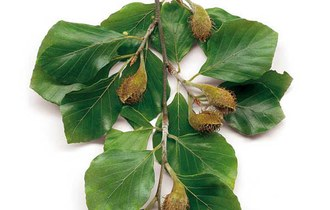

Fagus sylvatica – łac. fagus od gr. phegos „buk”; łac. silvaticus „leśny”, od łac. silva „las”; nazwa znana od starożytności. Rodzina: Bukowate (Fagaceae)
### [Cis pospolity](drzewa/cis_pospolity.md)
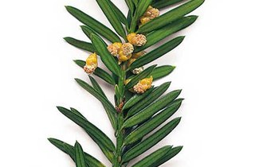

Taxus baccata. Rodzina: Cisowate (Taxaceae)
### [Czereśnia ptasia](drzewa/czeresnia_ptasia.md)
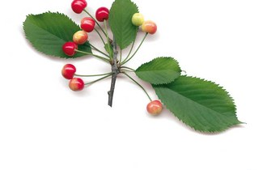

Prunus avium. Rodzina: Różowate (Rosaceae)
### [Daglezja zielona](drzewa/daglezja_zielona.md)
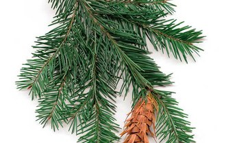

Pseudotsuga menziesii. Rodzina: Sosnowate (Pinaceae)
### [Dąb bezszypułkowy](drzewa/dab_bezszypulkowy.md)
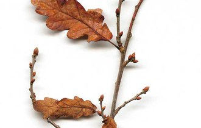

Quercus petraea – łac. quercus „dąb”; łac. petraeus „naskalny, rosnący na skałach”, od łac. petra „skała”; nazwa znana od czasów starożytnych.
### [Dąb szypułkowy](drzewa/dab_szypulkowy.md)
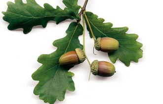

Quercus robur – łac. quercus „dąb”; łac. robur „drewno dębu”, ale także „siła, moc” (nawiązanie do rozmiarów i kształtu drzewa); nazwa znana od czasów starożytnych.
### [Grab zwyczajny](drzewa/grab_zwyczajny.md)
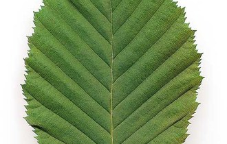

Carpinus betulus – łac. carpinus „grab”; łac. betulus „podobny do brzozy pod pewnym względem”; nazwa znana od czasów starożytnych.
### [Grusza pospolita](drzewa/grusza_pospolita.md)
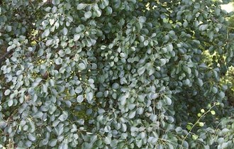

Pyrus pyraster
### [Jabłoń dzika](drzewa/jablon_dzika.md)
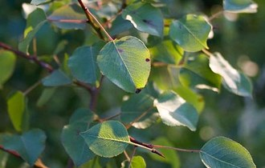

Malus sylvestris
### [Jarząb brekinia](drzewa/jarzab_brekinia.md)
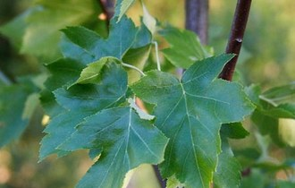

Sorbus torminalis
### [Jesion wyniosły](drzewa/jesion_wyniosly.md)
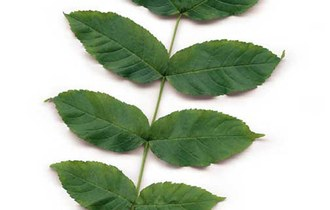

Fraxinus excelsior – łac. fraxinus od gr. phraxis „ogrodzenie, płot” (od sposobu użytkowania rośliny) lub od łac. frango „łamię” (odniesienie do łupliwości drewna); łac. excelsus „wyniosły” (podkreślenie okazałych rozmiarów drzewa); nazwa znana od czasów starożytnych.
### [Jodła pospolita](drzewa/jodla_pospolita.md)
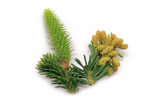

Abies alba – łac. abies, w sanskrycie abh oznacza „być bujnym, obfitować” (dotyczy pokroju drzewa); łac. albus „biały”; nazwa znana już w starożytności.
### [Kasztanowiec pospolity](drzewa/kasztanowiec_pospolity.md)
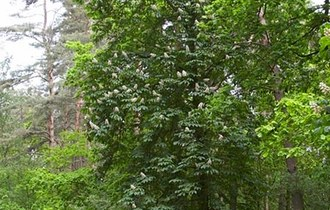

Aesculus hippocastanum
### [Klon jawor](drzewa/klon_jawor.md)
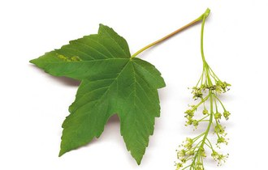

Acer pseudoplatanus – od łac. acer „ostry” lub od gr. akeros „bezrogi”; pseudoplatanus „fałszywy platan”, od gr. pseudes „fałszywy, zmyślony”, łac. platanus „platan”; nazwa znana od czasów starożytnych.
### [Klon polny](drzewa/klon_polny.md)
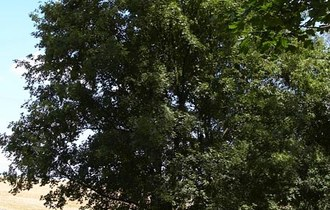

Klon polny (Acer campestre)
### [Klon zwyczajny](drzewa/klon_zwyczajny.md)
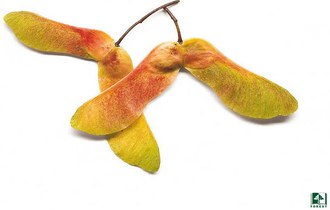

Acer platanoides – od łac. acer „ostry” lub od gr. akeros „bezrogi”; łac. platanoides „pokrewny z platanem, zbliżony do platanu”, od łac. platanus „platan”, łac. -ides – przyrostek oznaczający zbliżenie, pokrewieństwo; nazwa znana od czasów starożytnych.
### [Lipa drobnolistna](drzewa/lipa_drobnolistna.md)
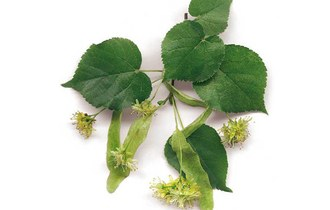

Tilia cordata – łac. tilia „lipa”; łac. cordatus „sercowaty, w kształcie serca” (odniesienie do kształtu liści); nazwa znana od czasów starożytnych.
### [Lipa szerokolistna](drzewa/lipa_szerokolistna.md)

Tilia platyphyllos – łac. tilia „lipa”; gr. platyphyllos „szerokolistny”, od gr. platys „szeroki” i gr. phyllon „liść”; nazwa znana od czasów starożytnych.
### [Modrzew europejski](drzewa/modrzew_europejski.md)
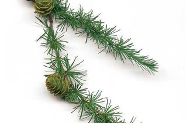

Larix decidua – łac. larix, od łac. laridum „słonina” (być może nawiązanie do połyskującej, „tłustej” żywicy); łac. decido, decidere „odpadać” (wskazanie na igły opadające na zimę); nazwa znana od czasów starożytnych.
### [Olsza czarna](drzewa/olsza_czarna.md)
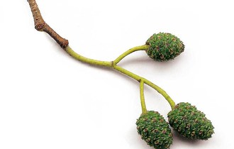

Alnus glutinosa – łac. alnus „olsza”; łac. gluten „klej”.
### [Olsza szara](drzewa/olsza_szara.md)
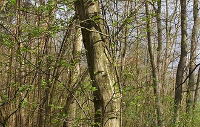

Alnus incana
### [Robinia akacjowa](drzewa/robinia_akacjowa.md)

Robinia pseudacacia – robinia od nazwiska Jeana Robina (1550-1629), botanika francuskiego, który sprowadził roślinę do Paryża; łac. pseudacacia, „fałszywa akacja”, od gr. pseudes „fałszywy, zmyślony”.
### [Sosna wejmutka](drzewa/sosna_wejmutka.md)
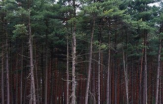

Pinus strobus
### [Sosna zwyczajna](drzewa/sosna_zwyczajna.md)
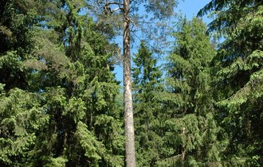

Pinus sylvestris – łac. pinus „dostarczający żywicy”, od łac. pix „smoła, żywica”; łac. silvestris „leśny”, od łac. silva „las”; nazwa znana od czasów starożytnych.
### [Świerk pospolity](drzewa/swierk_pospolity.md)
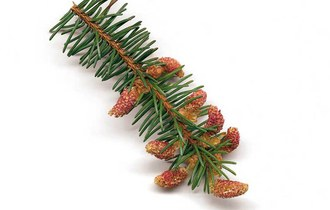

Picea abies – łac. picea „wydzielający żywicę”, od łac. pix „smoła, żywica”; łac. abies, w sanskrycie abh „być bujnym, obfitować” (dotyczy pokroju drzewa); nazwa znana od czasów starożytnych.
### [Topola biała](drzewa/topola_biala.md)
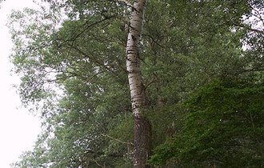

Populus alba
### [Topola osika](drzewa/topola_osika.md)
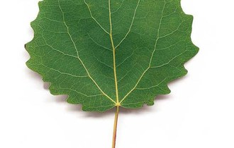

Populus tremula – łac. populus „topola”; łac. tremo, tremere „drżeć, trząść się”; nazwa znana od czasów starożytnych.
### [Wiąz polny](drzewa/wiaz_polny.md)
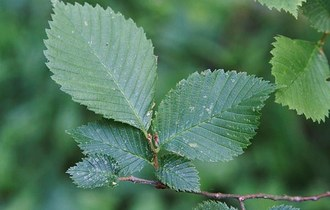

Ulmus minor
### [Wiąz szypułkowy](drzewa/wiaz_szypulkowy.md)
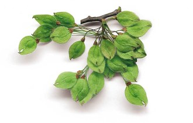

Ulmus laevis – łac. ulmus „wiąz”; łac. laevis „gładki, nagi, śliski” (być może nawiązanie do liści, które z wierzchu są gładkie lub nieznacznie szorstkie); nazwa znana od czasów starożytnych.
### [Wierzba biała](drzewa/wierzba_biala.md)
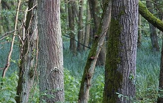

Salix alba
